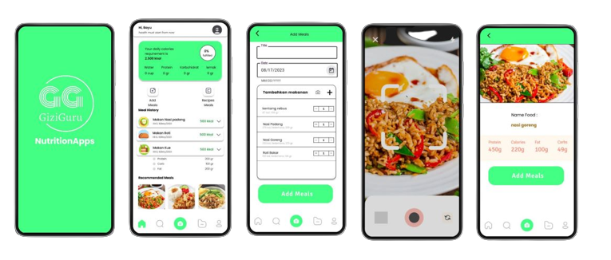

# GiziGuru APP
<h2 align="center">GiziGuru Aplication</h2>

 

### Mobile Development
#### Prerequisites
1. Android 7.0 Lollipop (SDK 24) or above.
2. Internet Connection.

#### Installation
1. Download the APK Files [here](https://drive.google.com/file/d/1508BSha0LK1RfWCtldYRFmEY31QQz-Fl/view?usp=sharing).
2. Install APK FIles (Allow permission install from Unknown Source).

#### How to use
1. Open App.
2. First Page you are in is SIGN IN page, in that page you can input your username and password, if you arleady have an Account also you can move from SIGN IN to REGISTER page and and the opposite.
3. In REGISTER page you need to input all the information needed
4. Both from SIGN IN and REGISTER you will be directeed to HOME page, in HOME page you can see your daily needs. You can also add meals to it will shows in HISTORY page. There are total 5 menu HOME, EXPLORE, SCAN, HISTORY, and PROFILE
5. EXPLORE page is showing all list of meals that is in our database
6. HISTORY is list from meals you add from AddMeals
7. SCAN is where you have to grant permission for camera then you can take picture with it, after picture taken that taken image will be analyzed then Nutritional data will display for you. You can do this multiple time
8. Lastly is PROFILE is when you can see your profile information also you can Logout from there
 
